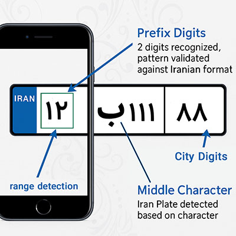

# 🚧 Offline Vehicle Access Management System (Real-world Deployment)

> _Note: For security reasons, the name of the organization where this system was deployed has been omitted._

This project was built and used in a high-security offline environment to manage the entry and exit of vehicles into a protected facility. The goal was to eliminate manual paper-based logs and introduce a secure, locally-contained, and fast identification mechanism using smartphones and a local wireless network.

---

## 🔧 Tech Stack

- **PHP** (Web API backend)
- **HTML/CSS/JS/AJAX** (Web-based admin panel)
- **Android (Java)** (Client app for security guards)
- **SQLite** (Lightweight local storage on Android)
- **MySQL** (Local web server database)
- **Local WiFi Hotspot** (Manual, offline networking)
- **Printer Integration** (HTML-to-thermal-printable pass)

---

## 📲 System Architecture

The system consisted of:

- A **local web server** hosted on a laptop that doubled as a WiFi hotspot
- An **Android app** installed on guard phones which connected to this hotspot
- A **PHP API** for two-way communication between clients and the database
- An **offline-compatible printer** connected to the server laptop

This created a self-contained LAN without internet access, optimized for vehicle logging.

---

## 🔄 Workflow

1. Visitor or staff vehicle approaches gate
2. Guard opens the mobile app and scans the license plate
3. If plate exists in database:
   - Information (name, role, clearance) is displayed instantly
   - A thermal gate pass is printed and handed over
4. If plate is unknown:
   - Guard registers vehicle in app
   - Entry is subject to supervisor pre-approval or clearance rule

If flagged as **restricted**, entry is denied or referred to main admin panel for override.

---

## 🎯 Key Features

- 🔍 **Real-time Plate Recognition**
- 🧠 **Pattern-aware Parsing for Iranian Plate Formats**
- 🗂️ **Local caching to handle network fluctuations**
- 📑 **Printable Entry/Exit Slips**
- 📈 **Reporting panel with filters (daily, weekly, custom)**
- 🔐 **User Access Control with multi-role login system**

---

## 📸 Plate Recognition Flow

The image above shows how the Android client identified Persian license plates:
- Region-of-interest selection (camera overlay)
- Persian character isolation (e.g., distinguishing "ب" from "پ")
- Numeric segment parsing
- Final city code recognition based on 2-digit suffix
- Vehicle classification based on plate color and special letters (e.g., ث, پ)
- Used camera to frame license plate area
- Extracted following data structure:
  - `##` (left side two digits)
  - `Letter` (middle Persian character)
  - `###` (right block of numbers)
  - `City Code` (far right)
- Applied heuristics:
  - Valid character filtering (e.g. "پ" for Police)
  - Plate type classification based on color/style
  - City code lookup (e.g. "79" = Rasht)
  - Redundancy check using digit-letter pattern validation
---

## 🧩 Lessons Learned

- 📶 Wireless hotspot stability was initially unreliable, especially when multiple phones connected. Switching to manual IP configurations helped.
- 📷 Some plates had **reflective glare** that interfered with character recognition — using a darker camera overlay box resolved this.
- 🖨️ Thermal printer driver failed on certain Unicode fonts; fallback to a monospaced Persian-supported font fixed it.
- 🧠 Optimization for older Android devices was critical — we rewrote UI layers to avoid hardware acceleration issues.

---

## 🔒 Deployment Context

- The system was live and actively used for **10+ months** by gate personnel.
- All data stayed **local**, with regular USB-based encrypted backups.
- Decommissioned later due to changes in administrative leadership.

---

## ⚠️ Final Notes

While the project was shut down without formal documentation or credit, it represented a fully operational, secure-by-design system solving a real organizational pain point.

This repository serves as an **architectural and engineering demonstration** of what can be achieved even in constrained, offline-only, security-driven deployments.

---

## ✉️ Contact

For more information or context regarding the implementation, feel free to contact the maintainer.
